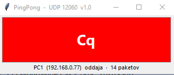

# PingPong – N1MM Logger+ UDP 12060 Lamps

> **Version:** 1.1 · Made by **S55OO** with AI assistance.

Shows which computer/station on the network is currently **transmitting**.
It listens to the N1MM Logger+ external UDP broadcast (XML) on port **12060**
and displays the caption of the pressed function key in that station's color.

Two tools are provided:

| File | What it is |
|---|---|
| `n1mm_lamps.py` / `n1mm_lamps.exe` | **Lamp** – small window that lights up in the color of the station on transmit |
| `n1mm_watch.py` / `PingPong.bat` | **Watcher** – detailed log of all packets (debug/analysis) |

---

## Screenshot



---

## 1. N1MM Logger+ setup

1. On each N1MM Logger+ PC: **File → Settings → Configurer →
   External Broadcast**, enable the reports you need (**RadioInfo**,
   **ContactInfo**, **Spot**, **AppInfo**, **dynamicresults** …).
2. **Broadcast Address**: your subnet broadcast (e.g. `192.168.178.255`)
   so every PC sees every station. Use the address of whichever network
   you run on – **LAN or VPN** – and match it in N1MM on every PC.
3. **Broadcast Port**: `12060` (default, do not change).
4. Per N1MM: **“Broadcast Data” must also be enabled on the other
   computers** (e.g. Run2), otherwise they send nothing.

> The app listens on all interfaces and **discovers stations
> automatically** – no per-PC IP configuration is needed. It follows the
> traffic that N1MM broadcasts, whether that arrives over your LAN or a
> VPN link.

> N1MM only broadcasts the key **caption** (e.g. `F1 CQ`), not the
> expanded CW/text. `Freq` in `RadioInfo` is in units of 10 Hz:
> Freq=701500 means 7015.00 kHz.

---

## 2. Lamp (n1mm_lamps.py / n1mm_lamps.exe)

### Behavior

- The lamp lights up **exactly as long as the station is actually
  transmitting**: it turns on at `IsTransmitting=True` and turns off
  immediately at `False`.
- The window shows the text of the last pressed function key (the `Fx`
  prefix is stripped).
- The window is always on top (`topmost`).

### Group key (band + mode)

The window shows **only transmissions from stations on the same band and
mode as the local computer** (the one running the window):

- Bands: **1.8, 3.5, 7, 14, 21, 28** MHz
- Modes: **CW, RTTY, USB, LSB**

Example: PC1, PC2, PC3 on 14 MHz CW → colors alternate nicely. If PC4 is on
e.g. 7 MHz CW, its transmissions are **never** shown in this window, and
vice versa.

- The key follows the local station automatically when it changes band/mode
  (the footer shows `watching 14 CW`).
- A station on none of these bands/modes is never displayed.

### Running

```bat
        double-click:  n1mm_lamps.exe     (standalone executable)
   or:  run:  pythonw n1mm_lamps.py       (from source, no window)
```

Arguments:

```bat
python n1mm_lamps.py [--port 12060] [--stale 5.0] [--config lamps.cfg]
```

- `--port` – UDP port (default 12060).
- `--stale` – safety fallback in seconds; if no packet arrives from the
  transmitting station within this time, the lamp turns off (default 5.0).
- `--config` – path to `lamps.cfg`.

### lamps.cfg (optional)

Automatic station detection works **even without** this file. Stations
are assigned colors **in order of appearance**: the first detected station
gets **red**, the second **orange**, the third **light blue**, the fourth
**light green**, and so on through the rest of the palette (purple, cyan,
gold, pink, brown, lime green).

To assign stable labels/colors manually, each line is:

```
IP,label,color
```

Example:

```
192.168.178.55,PC1,red
192.168.178.56,Run2,orange
192.168.178.57,Run3,light blue
192.168.178.58,Run4,light green
```

- Lines starting with `#` are skipped.
- When a new station is detected that is **not** in `lamps.cfg`, the app
  assigns it the next unused palette color **in order of appearance** and
  **writes the entry back to `lamps.cfg`** automatically, so the color stays
  fixed on the next run. Edit the file any time to override a label/color.
- `n1mm_lamps.exe` reads `lamps.cfg` from the **same folder as the exe**.

---

## 3. Watcher (n1mm_watch.py)

Detailed view of all UDP traffic: station table on the left, traffic on the
right, detail/hex of the selected packet at the bottom.

```bat
        double-click:  PingPong.bat
```

```bat
python n1mm_watch.py [--port 12060] [--bind 0.0.0.0] [--log FILE] [--selftest]
```

- **Stop/Listen** button – toggles listening.
- **Freeze** – stops adding rows (traffic still recorded).
- **Autoscroll** – follows the latest packet.
- **Hex/raw** – shows packet details as hex + raw XML.
- **Log to file** – JSON lines into `n1mm_pingpong.log` (default next to
  the script; change with `--log`).
- **Clear** – empties the display.
- `--selftest` – verifies parsing with sample packets.

---

## 4. Building the standalone EXE (for PCs without Python)

Requires Python + PyInstaller:

```bat
python -m pip install pyinstaller
python -m PyInstaller --onefile --windowed --name n1mm_lamps --manifest manifest.xml n1mm_lamps.py
copy /Y dist\n1mm_lamps.exe n1mm_lamps.exe
```

`manifest.xml` makes the window use modern common controls. The result is a
single `n1mm_lamps.exe` (no Python required) – copy it to the other
computers together with the (optional) `lamps.cfg`.

---

## 5. Files

```
n1mm_lamps.py    – lamp (source code)
n1mm_lamps.exe   – lamp (standalone, no Python needed)
lamps.cfg        – optional: IP,label,color (auto-written on first discovery)
n1mm_watch.py    – traffic watcher
PingPong.bat     – watcher launcher
manifest.xml     – PyInstaller manifest (common controls)
n1mm_lamps.spec  – last PyInstaller build settings
dist\            – PyInstaller output (current n1mm_lamps.exe)
```
